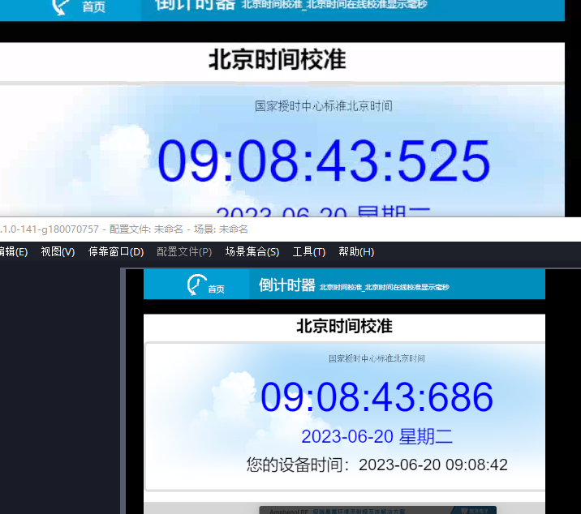

# WebRTC(WHIP/WHEP)

WebRTC在刚发布的时候仅仅专注于VoIP和点对点用例，它仅限于几个并发的浏览器,并且不能扩展，缺少标准信令交互，故很难用于直播场景。

在此背景下,WHIP和WHEP这2个标准的提出，补齐了信令交互这一个环节，使WebRTC可以运用在直播场景。

## WHIP(WebRTC-HTTP Ingestion Protocol)
协议链接:https://datatracker.ietf.org/doc/html/draft-murillo-whip-02

WHIP(WebRTC-HTTP Ingestion Protocol)是Milicast的技术团队提出的,在与媒体服务器通信时,WHIP提供了使用标准信令协议的编码软件和硬件，这样就可以实现厂商的WebRTC推流。WHIP在WebRTC上增加了一个简单的信令层，可用于将WebRTC发布者连接到WebRTC媒体服务器，发布者只发送媒体而不接收媒体。


### 交互流程
```
 +-------------+    +---------------+ +--------------+ +---------------+
 | WHIP client |    | WHIP endpoint | | Media Server | | WHIP Resource |
 +--+----------+    +---------+-----+ +------+-------+ +--------|------+
    |                         |              |                  |
    |                         |              |                  |
    |HTTP POST (SDP Offer)    |              |                  |
    +------------------------>+              |                  |
    |201 Created (SDP answer) |              |                  |
    +<------------------------+              |                  |
    |          ICE REQUEST                   |                  |
    +--------------------------------------->+                  |
    |          ICE RESPONSE                  |                  |
    |<---------------------------------------+                  |
    |          DTLS SETUP                    |                  |
    |<======================================>|                  |
    |          RTP/RTCP FLOW                 |                  |
    +<-------------------------------------->+                  |
    | HTTP DELETE                                               |
    +---------------------------------------------------------->+
    | 200 OK                                                    |
    <-----------------------------------------------------------x
```

（1）WHIP client使用HTTP POST请求执行单次SDP Offer/Answer，以便在编码器/媒体生产者(WHIP客户端)和广播接收端点(媒体服务器)之间建立ICE/DTLS会话。

（2）一旦ICE/DTLS会话建立，媒体将从编码器/媒体生成器(WHIP客户端)单向流向广播接收端点(媒体服务器)。为了降低复杂性，不支持SDP重新协商，因此在完成通过HTTP的初始SDP Offer/Answer后，不能添加或删除任何track或stream。

（3）HTTP POST请求的内容类型为“application/sdp”，并包含作为主体的SDP Offer。WHIP端点将生成一个SDP Answer并返回一个“201 Created”响应，内容类型为“application/SDP”。

## WHEP(WebRTC-HTTP Egress Protocol)
协议链接:https://datatracker.ietf.org/doc/html/draft-murillo-whep-02

WHEP(WebRTC-HTTP Egress Protocol)也是在WebRTC上增加了一个简单的信令层，可用于将WebRTC播放者连接到WebRTC媒体服务器，播放者只接收媒体，不发送媒体。

```
 +-------------+    +---------------+ +--------------+ +---------------+
 | WHEP Player |    | WHEP endpoint | | Media Server | | WHEP Resource |
 +--+----------+    +---------+-----+ +------+-------+ +--------|------+
    |                         |              |                  |
    |                         |              |                  |
    |HTTP POST (SDP Offer)    |              |                  |
    +------------------------>+              |                  |
    |201 Created (SDP answer) |              |                  |
    +<------------------------+              |                  |
    |          ICE REQUEST                   |                  |
    +--------------------------------------->+                  |
    |          ICE RESPONSE                  |                  |
    |<---------------------------------------+                  |
    |          DTLS SETUP                    |                  |
    |<======================================>|                  |
    |          RTP/RTCP FLOW                 |                  |
    +<-------------------------------------->+                  |
    | HTTP DELETE                                               |
    +---------------------------------------------------------->+
    | 200 OK                                                    |
    <-----------------------------------------------------------x
```

（1）WHEP Player使用HTTP POST请求执行单次SDP Offer/Answer，以便在WHEP Player和媒体服务器之间建立ICE/DTLS会话。

（2）一旦ICE/DTLS会话建立，媒体将从媒体服务器流向WHEP Player。为了降低复杂性，不支持SDP重新协商，因此在完成通过HTTP的初始SDP Offer/Answer后，不能添加或删除任何track或stream。

（3）HTTP POST请求的内容类型为“application/sdp”，并包含作为主体的SDP Offer。WHEP端点将生成一个SDP Answer并返回一个“201 Created”响应，内容类型为“application/SDP”。

## lalmax RTC
lalmax支持WHIP推流和WHEP拉流

视频:H264

音频:G711A/G711U

WHIP可以使用[vue-wish](https://github.com/zllovesuki/vue-wish)、[OBS](https://github.com/obsproject/obs-studio/actions/runs/5227109208?pr=7926)测试

WHEP拉流可以使用[vue-wish](https://github.com/zllovesuki/vue-wish)测试

### OBS测试效果
使用OBS进行whip推流到lalmax中，并用vue-wish拉流，测试延时可以做到200ms以内

OBS推流配置:


vue-wish拉流效果


